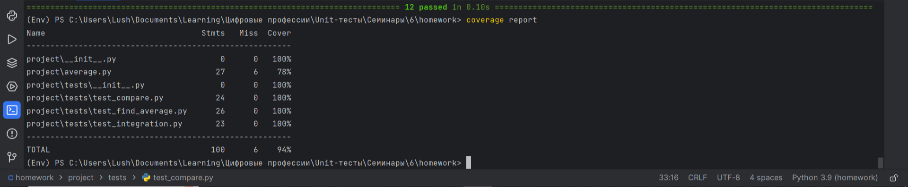

# Отчет о выполнении задания промежуточной аттестации
## Код программы
Размещен на GitHub: [Код программы](https://github.com/LushnikovSR/Unit-test_Lesson_6/blob/master/project/average.py)

## Код тестов
Размещен на GitHub: [Код тестов](https://github.com/LushnikovSR/Unit-test_Lesson_6/tree/master/project/tests)

## Отчет pylint

## Отчет о покрытии тестами coverage

## Объяснение принципа покрытия тестами
Программа состоит из двух статических методов: find и compare. При этом метод compare в ходе своей работы вызывает метод find.

Для данных методов были написаны unit-тесты.

При создании unit-тестов для метода compare, был использован patch для статического метода find, что позволило устранить зависимость метода compare от статического метода find. Однако сделало эти тесты хрупкими из-за  зависимости от последователности значений позвращаемых методом find внутри метода compare.

В целях проверки совместной работы методов были написаны интеграционные тесты.

Для проверки вывода метода compare была использована библиотека pytest. capsys перехватывает поток стандартного вывода и ошибок. Он позволяет записать эти данные в объект и обращаться к ним в ходе теста.
